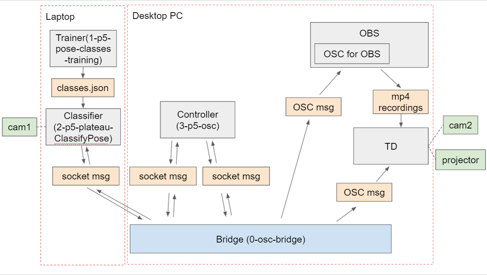

# doppel-code

## Software Requirements
- OBS + OBS WebSockets Plug-in
- TouchDesigner
- Node.js
- VS Code or equivalent for updating code if necessary

## Diagram

## Components
- 0-osc-bridge: the "Bridge". It's the socket & OSC server for relaying socket & OSC messages between sketches, OBS and TD
- 1-p5-pose-classes-training: the "Trainer". Used for the training of the classifications only and not for the show. it's default output is a classes.json file that will be loaded in the "Classifier".
- 2-p5-plateau-ClassifyPose: the "Classifier". Used for analyzing real NiNi's pose, and sending over live joint distance, pose classification, and plateau records with start/end timestamps to the "Controller".
- 3-p5-osc: the "Controller". It's the master controller sketch, used for controlling the performance modes, and sending socket msgs to the "Classifier", and sending commands to OBS & TD via OSC.

## Show Deplayment
On desktop PC:
- cd to 0-osc-bridge, npm install (if haven't already), node bridge.js
- (if using OBS to record) Open OBS, open OSC for OBS, configure the IPs and ports (if haven't already)
- Open max.toe in TouchDesigner under TD folder

Then, on a separate laptop:
- Open 2-p5-plateau-ClassifyPose folder. In sketch.js, update its IP to the desktop PC that runs bridge.js/OBS/TD, and serve the index.html file in http. This can be done on a separate computer.

Finally, on the desktop PC:
- Open 3-p5-osc folder. Serve the index.html in http, and follow instructions on screen. 
